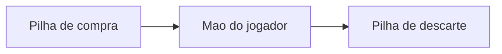

# ULTIMATE FIGHTING JAVA CHAMPIONSHIP - MC322

**Desenvolvido por:**
* Bruno Antonio Tretto - RA: 268060
* João Felipe Denadai Madeira - RA: 258477

## 📌 Sobre o Projeto
O objetivo deste projteo é desenvolver um sistema de batalhas via terminal, fortemente inspirado na logística do jogo "Slay the Spire". Para isso aplicamos os conceitos  da disciplina de Programação Orientada a Objetos (POO).

## Laboratório 1
Para esta implementação, adaptamos a dinâmica de combate para o universo do UFC. O usuário pode escolher o seu lutador dentre as opções disponíveis para enfrentar o oponente. A lógica principal foi mantida: o jogador precisa gerenciar sua energia a cada turno para atacar ou levantar a guarda (representado pelas cartas de escudo), buscando nocautear o adversário antes de ser derrotado.

## Laboratório 2
Neste laboratório implementamos os conceitos de herança, classes abstratas e polimorfismo.

A classe Carta é uma classe abstrata utilizada como superclasse para CartaDano e CartaEscudo. Da mesma forma, Entidade é uma classe abstrata utilizada como superclasse para Heroi e Inimigo.

### Baralho
Nesta implementação, adicionamos à logística do jogo estruturas de mao de cartas do jogador, pilha de compra e pilha de descarte. A cada rodada, a mão do jogador é adicionada de cartas advindas da pilha de compra. Ao fim da rodada, todas as cartas, utilizadas ou não, são colocadas na pilha de descarte. Quando a pilha de compras acaba, a pilha de descarte é transferida para a pilha de compras.

### Inimigo
O inimigo realiza golpes ou se defende baseando-se no cenário da partida: Caso a vida do herói seja muito alta ou, muito baixa ele prioriza os ataques, caso sua vida esteja muito baixa ele irá priorizar a sua defesa. Os seus valores de dano ou defesa são baseados em números pseudo-aleatórios. 



> **Embaralhamento**  
As listas não são embaralhadas no sentido de realizar um shuffle na posição das cartas dentro do array.

## Laboratório 3
Nessa implementação, foram adicionados os efeitos. Optamos pela lógica utilizada em jogos de luta, onde o jogador acumula uma certa Fúria que, quando cheia, permite utilizar um efeito no inimigo.
O valor de fúria é limitado a 3, e a cada ataque realizado é somada de 1.

### 🔥 Sistema de Fúria e Padrão Observer
Foi implementado um sistema de **Fúria**:  
- Toda vez que o herói utiliza uma carta de dano, ele acumula um ponto de fúria.  
- Ao atingir a carga máxima, o jogador ganha o direito de gastar essa fúria para embutir um **Efeito Especial** em uma de suas cartas, potencializando o golpe.  

O gerenciamento desses efeitos é feito pelo **Observer**:  
- A classe `Publisher` age como um "Juiz" da partida.  
- Sempre que um efeito é aplicado, ele é inscrito no Juiz.  
- Ao final de cada round, o Juiz notifica todos os efeitos inscritos para que eles ajam sobre os lutadores, removendo automaticamente aqueles cujos turnos já expiraram.

---

### ✨ Efeitos Especiais
Os efeitos duram **3 turnos** e trazem dinâmicas estratégicas para o combate:

- 🩸 **Sangramento**: Dano contínuo. A cada final de rodada, o alvo afetado perde uma quantia fixa de vida.  
- 🗣️ **Provocação**: Quebra de guarda. Reduz a quantidade de escudo que o alvo consegue gerar.  
- 💉 **Adrenalina**: Cura e buff. Aplicado no próprio herói, recupera pontos de vida a cada rodada.  

### Seccionamento
Algumas partes da main foram dividas em seções por comentários para facilitar a organização e manutenção do código. 


## 🪜 Estrutura do projeto
```
.
├── README.md
└── src
    ├── App.java
    ├── Cartas
    │   ├── Carta.java
    │   ├── CartaDano.java
    │   ├── CartaEfeito.java
    │   └── CartaEscudo.java
    ├── Efeitos
    │   ├── Adrenalina.java
    │   ├── Efeitos.java
    │   ├── Provocacao.java
    │   └── Sangramento.java
    ├── Entidades
    │   ├── Entidade.java
    │   ├── Heroi.java
    │   └── Inimigo.java
    ├── Jogo
    │   └── Publisher.java
    └── Prints
        ├── PrintsEntidades.java
        └── PrintsMain.java
```
Onde:
- src — contém todos os arquivos .java do projeto


## 🚀 Como compilar e executar

O projeto foi feito para ser compilado e executado através de comandos, conforme solicitado. Para isso deve-se ter instalado:
* Java Development Kit instalado.
* Terminal compatível.

Posteriormente, para compilar o código:
No repositório da tarefa X, execute o comando abaixo. Ele gerará os arquivos compilados

```bash
javac -d bin $(find src -name "*.java")
```

```bash
#Execução
java -cp bin App
```