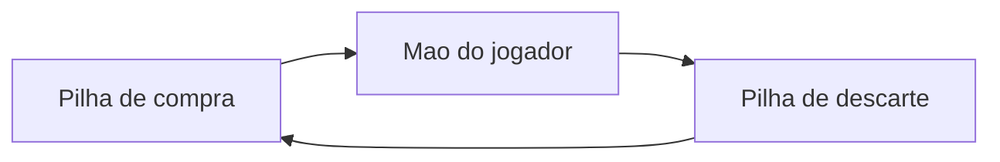
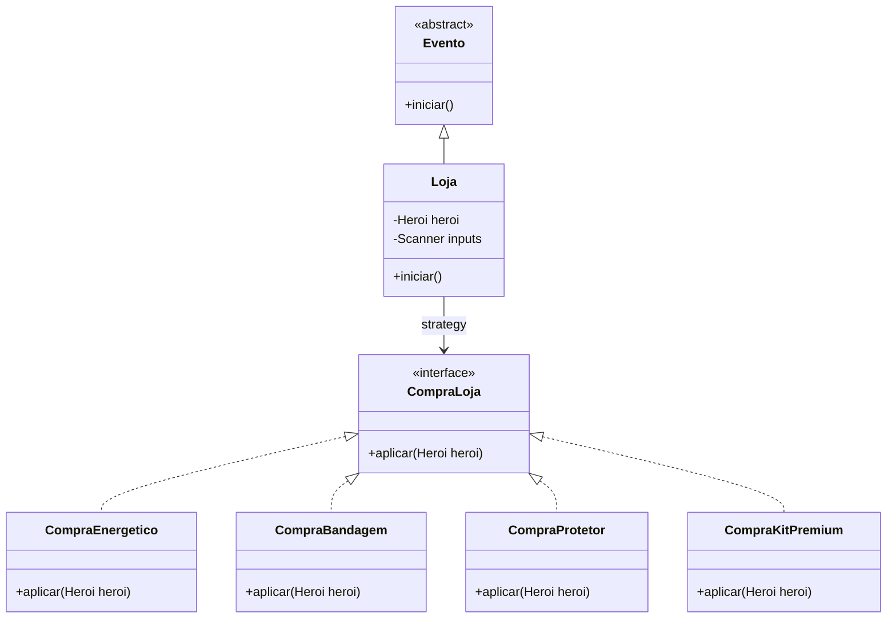
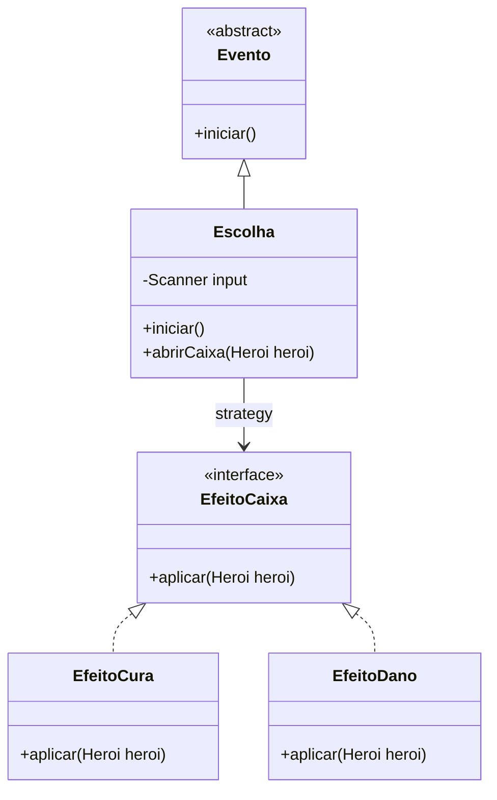

# ULTIMATE FIGHTING JAVA CHAMPIONSHIP - MC322

**Desenvolvido por:**
* Bruno Antonio Tretto - RA: 268060
* João Felipe Denadai Madeira - RA: 258477

## 📌 Sobre o Projeto
O objetivo deste projteo é desenvolver um sistema de batalhas via terminal, fortemente inspirado na logística do jogo "Slay the Spire". Para isso aplicamos os conceitos  da disciplina de Programação Orientada a Objetos (POO).

## 🎮 Como Jogar
Para entender as regras da luta, os atributos das cartas e como funciona o sistema de Fúria e Efeitos 👉 [Acesse o Manual Completo do Jogo aqui](MANUAL_DO_JOGO.md) 

## 🧭 Sumário
- [Tarefa 1](#tarefa-1)
- [Tarefa 2](#tarefa-2)
- [Tarefa 3](#tarefa-3)
- [Tarefa 4](#tarefa-4)
- [Tarefa 5](#tarefa-5)
- [Tarefa 6](#tarefa-6)
- [🪜 Estrutura do projeto](#estrutura-do-projeto)
- [🚀 Como compilar e executar](#como-compilar-e-executar)

---

## 📚 Tarefas

## Tarefa 1
Para esta implementação, adaptamos a dinâmica de combate para o universo do UFC. O usuário pode escolher o seu lutador dentre as opções disponíveis para enfrentar o oponente. A lógica principal foi mantida: o jogador precisa gerenciar sua energia a cada turno para atacar ou levantar a guarda (representado pelas cartas de escudo), buscando nocautear o adversário antes de ser derrotado.

---

## Tarefa 2
Nesta Terefa implementamos os conceitos de herança, classes abstratas e polimorfismo.

A classe Carta é uma classe abstrata utilizada como superclasse para CartaDano e CartaEscudo. Da mesma forma, Entidade é uma classe abstrata utilizada como superclasse para Heroi e Inimigo.

### Baralho
Nesta implementação, adicionamos à logística do jogo estruturas de mao de cartas do jogador, pilha de compra e pilha de descarte. A cada rodada, a mão do jogador é adicionada de cartas advindas da pilha de compra. Ao fim da rodada, todas as cartas, utilizadas ou não, são colocadas na pilha de descarte. Quando a pilha de compras acaba, a pilha de descarte é transferida para a pilha de compras.

### Inimigo
O inimigo realiza golpes ou se defende baseando-se no cenário da partida: Caso a vida do herói seja muito alta ou, muito baixa ele prioriza os ataques, caso sua vida esteja muito baixa ele irá priorizar a sua defesa. Os seus valores de dano ou defesa são baseados em números pseudo-aleatórios. 



> **Embaralhamento**  
As listas não são embaralhadas no sentido de realizar um shuffle na posição das cartas dentro do array.

---

## Tarefa 3
Nessa implementação, foram adicionados os efeitos. Optamos pela lógica utilizada em jogos de luta, onde o jogador acumula uma certa Fúria que, quando cheia, permite utilizar um efeito no inimigo.
O valor de fúria é limitado a 3, e a cada ataque realizado é somada de 1.

### 🔥 Sistema de Fúria e Padrão Observer
Foi implementado um sistema de **Fúria**:  
- Toda vez que o herói utiliza uma carta de dano, ele acumula um ponto de fúria.  
- Ao atingir a carga máxima, o jogador ganha o direito de gastar essa fúria para embutir um **Efeito Especial** em uma de suas cartas, potencializando o golpe.  

O gerenciamento desses efeitos é feito pelo **Observer**:  
- A classe `Publisher` age como um "Juiz" da partida.  
- Sempre que um efeito é aplicado, ele é inscrito no Juiz.  
- Ao final de cada round, o Juiz notifica todos os efeitos inscritos para que eles ajam sobre os lutadores, removendo automaticamente aqueles cujos turnos já expiraram.

---

### ✨ Efeitos Especiais
Os efeitos duram **3 turnos** e trazem dinâmicas estratégicas para o combate:

- 🩸 **Sangramento**: Dano contínuo. A cada final de rodada, o alvo afetado perde uma quantia fixa de vida.  
- 🗣️ **Provocação**: Quebra de guarda. Reduz a quantidade de escudo que o alvo consegue gerar.  
- 💉 **Adrenalina**: Cura e buff. Aplicado no próprio herói, recupera pontos de vida a cada rodada.  

### Seccionamento
Algumas partes da main foram dividas em seções por comentários para facilitar a organização e manutenção do código. 

---

## Tarefa 4
Nesta tarefa, o foco principal foi a organização e a documentação do projeto. A aplicação foi refatorada para o padrão Gradle (ferramenta de build para Java), e a documentação em Javadoc foi expandida para classes, métodos e atributos cuja implementação não era autoexplicativa.

### Nova dinâmica
- Mantivemos a possibilidade de enfrentar dois inimigos ao mesmo tempo (introduzida na Tarefa 3).
- No início da partida, é possível escolher entre os modos **1v1**, **1v2** ou **aleatório**. No modo aleatório, o jogo sorteia entre 1v1 e 1v2.

- Novo efeito: **Nocaute**. Ao ser usado, há **10% de chance** de eliminar o inimigo ao final do round, se a luta for 1v1 e **10% de chance** de a luta for 1v2.

- Cinco novas cartas foram adicionadas: **Joelhada**, **Cotovelada**, **Chute Alto**, **Chute Brasileiro** e **Clinch**.

- **Luta interativa:** Figuras com stickman foram adicionadas para representar os lutadores. Eles aparecem no cabeçalho dos rounds, demonstrando  se estão sob algum efeito, e também após cada golpe, com animações.

### Documentação Javadoc
- A documentação foi elaborada com auxílio de LLM, conforme orientação de que seu uso era permitido no laboratório 05.
- O modelo foi utilizado para gerar uma primeira versão completa da documentação, que depois foi revisada e corrigida pelos membros do grupo.

- **Pontos de atenção:**
> - Para evitar poluição visual e manter maior clareza, alguns métodos e parâmetros não foram documentados, principalmente os de lógica curta e/ou nomes intuitivos (ex: construtores, getters, setters e prints óbvios).

### Gradle
Com a adoção do Gradle, tarefas como compilação, execução e geração de documentação devem ser feitas pelos comandos da ferramenta.

> **Requisitos mínimos**
> - Java Development Kit (JDK)
> - Gradle

**Compilação e Execução**
```bash
# Na raiz do projeto
./gradlew build
./gradlew run
```

**Geração de documentação**
```bash
# Na raiz do projeto
./gradlew javadoc
```

> A documentação gerada fica em `app/build/docs/javadoc/index.html`.

---

## Tarefa 5
Nesta tarefa, implementamos um sistema de progressão entre múltiplas batalhas e adicionamos testes automatizados para garantir a estabilidade do código com o crescimento do projeto.

### Mapa e Progressão
Modelamos o mapa do jogo utilizando uma estrutura de **Árvore**, onde cada nó representa um combate distinto. 
- O jogador inicia no nó raiz e, segue percorrendo nós adjacentes progredindo pela campanha através do terminal.
- A vida e o baralho do herói são mantidos ao longo da progressão no mapa. Elementos voláteis do combate, como a energia, fúria e efeitos, são reiniciados a cada novo nó.
- A campanha termina em derrota caso a vida do herói chegue a zero, ou em vitória ao concluir com sucesso o nó final.

### Testes Automatizados
Introduzimos também testes unitários utilizando **JUnit**.
- Para medir a eficácia desses testes, utilizamos a biblioteca **JaCoCo** via Gradle, garantindo a cobertura mínima exigida (40%) dos principais caminhos lógicos do código.

### Salvamento dos dados (JSON)
Como funcionalidade extra, implementamos o salvamento do estado da partida. Caso o jogador opte por sair do jogo pelo menu interativo, seu progresso atual (incluindo vida, cartas do baralho e posição exata na árvore) é serializado e salvo em um arquivo **JSON**. Ao reiniciar a aplicação, os dados são carregados para que a luta continue do ponto em que parou.

---

## Tarefa 6
O foco principal da Tarefa 6 foi expandir a dinâmica do jogo. Para isso, adicionamos dois novos elementos de progressão ao longo da campanha: uma loja interativa e caixas surpresa espalhadas pelo mapa. Também introduzimos um sistema de recompensa, no qual o jogador é recompensado com moedas de ouro após cada vitória, podendo utilizá-las para adquirir melhorias na loja.

### Loja
A loja pode ser visitada a qualquer momento em que o jogador está no mapa de progressão. Lá, é possível gastar o ouro acumulado em itens que concedem bônus variados para os próximos confrontos.
O sistema da loja foi desenvolvido na classe `Loja.java`. Para organizar a lógica dos itens, aplicamos o padrão de projeto **Strategy**. Com ele, cada item da loja foi encapsulado em uma classe independente, responsável apenas por aplicar seu efeito no herói. Assim, a classe principal `Loja.java` fica responsável por validar a escolha do jogador, verificar se há ouro suficiente e então escolher qual estratégia será aplicada.

Fonte consultada: https://refactoring.guru/design-patterns/strategy

O diagrama UML abaixo ilustra a adoção desse padrão:




### Box surpresa
As caixas surpresa são eventos aleatórios distribuídos pelos caminhos do mapa. Ao encontrar uma caixa, o jogador deve decidir se assume o risco de abri-la ou se a ignora. Caso opte por abri-la, a caixa revelará uma consequência aleatória, que pode ser positiva (como curar +15 de vida) ou negativa (como sofrer -15 de dano).
Para organizar essa lógica de consequências, aplicamos o padrão de projeto **Strategy**. Com ele, cada possível resultado da caixa foi encapsulado em uma classe independente (uma "estratégia"). Assim, a classe principal `Escolha.java` fica responsável apenas por sortear qual estratégia será aplicada. O diagrama UML abaixo ilustra a adoção desse padrão:

Fonte consultada: https://refactoring.guru/design-patterns/strategy




## Estrutura do projeto
> - Diagrama simplificado da estrutura de pastas do projeto, indicando o caminho para arquivos essenciais.
```text
.
├── app
│   ├── build.gradle
│   ├── save.json / saveTorneio.json
│   └── src
│       ├── main
│       │   ├── java
│       │   │   ├── App.java (Ponto de entrada)
│       │   │   ├── Arvore/
│       │   │   ├── Cartas/      # Lógica de dano, escudo e efeitos
│       │   │   ├── Efeitos/     # Sangramento, adrenalina, nocaute, etc.
│       │   │   ├── Entidades/   # Classes Heroi e Inimigo
│       │   │   ├── Evento/      # Sistema de batalha, loja e caixas
│       │   │   ├── Jogo/        # Sistema de salvamento e publishers
│       │   │   └── Prints/      # Lógica de renderização da luta no terminal
│       │   └── resources/       # Arquivos .txt das animações e telas
│       └── test/                # Testes unitários das regras de negócio
├── build.gradle
├── gradle.properties
├── gradlew / gradlew.bat
├── MANUAL_DO_JOGO.md
└── README.md

```

## Como compilar e executar:
> **Requisitos mínimos**
> - Java Development Kit (JDK)
> - Gradle

**Compilação e Execução**
```bash
# Na raiz do projeto
./gradlew build
./gradlew run
```

**Geração de documentação**
```bash
# Na raiz do projeto
./gradlew javadoc
```

> A documentação gerada fica em `app/build/docs/javadoc/index.html`.
> Para consultar o reultado dos testes: `app/build/reports/jacoco/index.html`.