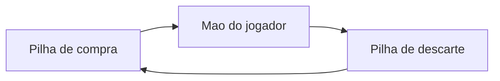

# ULTIMATE FIGHTING JAVA CHAMPIONSHIP - MC322

**Desenvolvido por:**
* Bruno Antonio Tretto - RA: 268060
* João Felipe Denadai Madeira - RA: 258477

## 📌 Sobre o Projeto
O objetivo deste projteo é desenvolver um sistema de batalhas via terminal, fortemente inspirado na logística do jogo "Slay the Spire". Para isso aplicamos os conceitos  da disciplina de Programação Orientada a Objetos (POO).

## Terefa 1
Para esta implementação, adaptamos a dinâmica de combate para o universo do UFC. O usuário pode escolher o seu lutador dentre as opções disponíveis para enfrentar o oponente. A lógica principal foi mantida: o jogador precisa gerenciar sua energia a cada turno para atacar ou levantar a guarda (representado pelas cartas de escudo), buscando nocautear o adversário antes de ser derrotado.

## Terefa 2
Nesta Terefa implementamos os conceitos de herança, classes abstratas e polimorfismo.

A classe Carta é uma classe abstrata utilizada como superclasse para CartaDano e CartaEscudo. Da mesma forma, Entidade é uma classe abstrata utilizada como superclasse para Heroi e Inimigo.

### Baralho
Nesta implementação, adicionamos à logística do jogo estruturas de mao de cartas do jogador, pilha de compra e pilha de descarte. A cada rodada, a mão do jogador é adicionada de cartas advindas da pilha de compra. Ao fim da rodada, todas as cartas, utilizadas ou não, são colocadas na pilha de descarte. Quando a pilha de compras acaba, a pilha de descarte é transferida para a pilha de compras.

### Inimigo
O inimigo realiza golpes ou se defende baseando-se no cenário da partida: Caso a vida do herói seja muito alta ou, muito baixa ele prioriza os ataques, caso sua vida esteja muito baixa ele irá priorizar a sua defesa. Os seus valores de dano ou defesa são baseados em números pseudo-aleatórios. 



> **Embaralhamento**  
As listas não são embaralhadas no sentido de realizar um shuffle na posição das cartas dentro do array.

## Terefa 3
Nessa implementação, foram adicionados os efeitos. Optamos pela lógica utilizada em jogos de luta, onde o jogador acumula uma certa Fúria que, quando cheia, permite utilizar um efeito no inimigo.
O valor de fúria é limitado a 3, e a cada ataque realizado é somada de 1.

### 🔥 Sistema de Fúria e Padrão Observer
Foi implementado um sistema de **Fúria**:  
- Toda vez que o herói utiliza uma carta de dano, ele acumula um ponto de fúria.  
- Ao atingir a carga máxima, o jogador ganha o direito de gastar essa fúria para embutir um **Efeito Especial** em uma de suas cartas, potencializando o golpe.  

O gerenciamento desses efeitos é feito pelo **Observer**:  
- A classe `Publisher` age como um "Juiz" da partida.  
- Sempre que um efeito é aplicado, ele é inscrito no Juiz.  
- Ao final de cada round, o Juiz notifica todos os efeitos inscritos para que eles ajam sobre os lutadores, removendo automaticamente aqueles cujos turnos já expiraram.

---

### ✨ Efeitos Especiais
Os efeitos duram **3 turnos** e trazem dinâmicas estratégicas para o combate:

- 🩸 **Sangramento**: Dano contínuo. A cada final de rodada, o alvo afetado perde uma quantia fixa de vida.  
- 🗣️ **Provocação**: Quebra de guarda. Reduz a quantidade de escudo que o alvo consegue gerar.  
- 💉 **Adrenalina**: Cura e buff. Aplicado no próprio herói, recupera pontos de vida a cada rodada.  

### Seccionamento
Algumas partes da main foram dividas em seções por comentários para facilitar a organização e manutenção do código. 

## Tarefa 4
Nesta tarefa, o foco principal foi a organização e a documentação do projeto. A aplicação foi refatorada para o padrão Gradle (ferramenta de build para Java), e a documentação em Javadoc foi expandida para classes, métodos e atributos cuja implementação não era autoexplicativa.

### Nova dinâmica
- Mantivemos a possibilidade de enfrentar dois inimigos ao mesmo tempo (introduzida na Tarefa 3).
- No início da partida, é possível escolher entre os modos **1v1**, **1v2** ou **aleatório**. No modo aleatório, o jogo sorteia entre 1v1 e 1v2.

- Novo efeito: **Nocaute**. Ao ser usado, há **10% de chance** de eliminar o inimigo ao final do round, se a luta for 1v1 e **10% de chance** de a luta for 1v2.

- Cinco novas cartas foram adicionadas: **Joelhada**, **Cotovelada**, **Chute Alto**, **Chute Brasileiro** e **Clinch**.

- **Luta interativa:** Figuras com stickman foram adicionadas para representar os lutadores. Eles aparecem no cabeçalho dos rounds, demonstrando  se estão sob algum efeito, e também após cada golpe, com animações.


### Documentação Javadoc
- A documentação foi elaborada com auxílio de LLM, conforme orientação de que seu uso era permitido no laboratório 05.
- O modelo foi utilizado para gerar uma primeira versão completa da documentação, que depois foi revisada e corrigida pelos membros do grupo.

- **Pontos de atenção:**
> - Para evitar poluição visual e manter maior clareza, alguns métodos e parâmetros não foram documentados, principalmente os de lógica curta e/ou nomes intuitivos (ex: construtores, getters, setters e prints óbvios).

### Gradle
Com a adoção do Gradle, tarefas como compilação, execução e geração de documentação devem ser feitas pelos comandos da ferramenta.

> **Requisitos mínimos**
> - Java Development Kit (JDK)
> - Gradle


**Compilação e Execução**
```bash
# Na raiz do projeto
./gradlew build
./gradlew run
```

**Geração de documentação**
```bash
# Na raiz do projeto
./gradlew javadoc
```

> A documentação gerada fica em `app/build/docs/javadoc/index.html`.


## 🪜 Estrutura do projeto
> - Diagrama simplificado da estrutura de pastas do projeto, indicando o caminho para arquivos essenciais.
```
.
├── app
│   ├── bin/
│   ├── build
│   │   ├── classes (.class files)
│   │   ├── docs
│   │   │   └── javadoc
│   │   ├── resources
│   │   │   └── main
│   │   │       ├── Derrota.txt
│   │   │       ├── Heroi.txt
│   │   │       ├── Inimigo.txt
│   │   │       ├── Inimigo2.txt
│   │   │       ├── Printinicial.txt
│   │   │       └── Vitoria.txt
│   ├── build.gradle
│   └── src
│       ├── main
│       │   ├── java
│       │   │   ├── App.java
│       │   │   ├── Cartas
│       │   │   │   ├── CartaDano.java
│       │   │   │   ├── CartaEfeito.java
│       │   │   │   ├── CartaEscudo.java
│       │   │   │   └── Carta.java
│       │   │   ├── Efeitos
│       │   │   │   ├── Adrenalina.java
│       │   │   │   ├── Efeitos.java
│       │   │   │   ├── Nocaute.java
│       │   │   │   ├── Provocacao.java
│       │   │   │   ├── Sangramento.java
│       │   │   │   └── Subscriber.java
│       │   │   ├── Entidades
│       │   │   │   ├── Entidade.java
│       │   │   │   ├── Heroi.java
│       │   │   │   └── Inimigo.java
│       │   │   ├── Jogo
│       │   │   │   ├── Aux.java
│       │   │   │   └── Publisher.java
│       │   │   └── Prints
│       │   │       ├── AnimacaoLuta.java
│       │   │       ├── PrintsEntidades.java
│       │   │       ├── PrintsMain.java
│       │   │       └── LutaInterativa/
│       │   │           ├── 1vs1/
│       │   │           └── 1vs2/
│       │   └── resources
│       │       ├── Derrota.txt
│       │       ├── Heroi.txt
│       │       ├── Inimigo.txt
│       │       ├── Inimigo2.txt
│       │       ├── Printinicial.txt
│       │       └── Vitoria.txt
│       └── test
│           └── java
│               └── AppTest.java
├── build/
├── gradle.properties
├── gradlew
├── gradlew.bat
├── README.md
└── settings.gradle
```

## 🚀 Como compilar e executar
- Visite [Gradle](#gradle)
