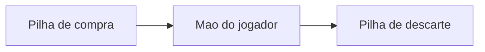

# ULTIMATE FIGHTING JAVA CHAMPIONSHIP - MC322

**Desenvolvido por:**
* Bruno Antonio Tretto - RA: 268060
* João Felipe Denadai Madeira - RA: 258477

## 📌 Sobre o Projeto
O objetivo deste projteo é desenvolver um sistema de batalhas via terminal, fortemente inspirado na logística do jogo "Slay the Spire". Para isso aplicamos os conceitos  da disciplina de Programação Orientada a Objetos (POO).

## Laboratório 1
>Para esta implementação, adaptamos a dinâmica de combate para o universo do UFC. O usuário pode escolher o seu lutador dentre as opções disponíveis para enfrentar o oponente. A lógica principal foi mantida: o jogador precisa gerenciar sua energia a cada turno para atacar ou levantar a guarda (representado pelas cartas de escudo), buscando nocautear o adversário antes de ser derrotado.

## Laboratório 2
>Neste laboratório implementamos os conceitos de herança, classes abstratas e polimorfismo.

>A classe Carta é uma classe abstrata utilizada como superclasse para CartaDano e CartaEscudo. Da mesma forma, Entidade é uma classe abstrata utilizada como superclasse para Heroi e Inimigo.

### Baralho
> Nesta implementação, adicionamos à logística do jogo estruturas de mao de cartas do jogador, pilha de compra e pilha de descarte. A cada rodada, a mão do jogador é adicionada de cartas advindas da pilha de compra. Ao fim da rodada, todas as cartas, utilizadas ou não, são colocadas na pilha de descarte. Quando a pilha de compras acaba, a pilha de descarte é transferida para a pilha de compras.




> **Embaralhamento**  
As listas não são embaralhadas no sentido de realizar um shuffle na posição das cartas dentro do array. Nesse caso, nós optamos pela geração de números pseudo-aleatórios contidos no range da quantidade de cartas disponíveis para serem o índice de acesso no array de compra, para simular a aleatoriedade causada por um embaralhamento. 

## 🪜 Estrutura do projeto
```
.
├── README.md
└── src
    ├── App.java
    ├── CartaDano.java
    ├── CartaEscudo.java
    ├── Carta.java
    ├── Entidade.java
    ├── Heroi.java
    └── Inimigo.java
```
Onde:
- src — contém todos os arquivos .java do projeto


## 🚀 Como compilar e executar

O projeto foi feito para ser compilado e executado através de comandos, conforme solicitado. Para isso deve-se ter instalado:
* Java Development Kit instalado.
* Terminal compatível.

Posteriormente, para compilar o código:
No repositório da tarefa X, execute o comando abaixo. Ele gerará os arquivos compilados

```bash
javac -d bin $(find src -name "*.java")
```

```bash
#Execução
java -cp bin App
```